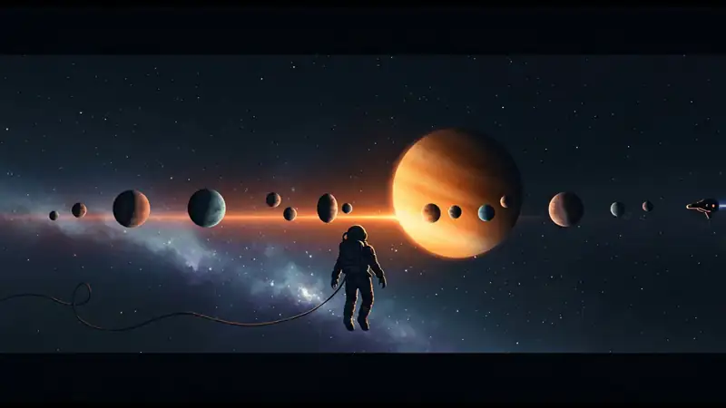

<p align="center">
  <a href="https://pablomanjarres.com/oss/lumen-frontier">
    
  </a>
</p>

<h1 align="center">Lumen Frontier</h1>

<p align="center"><i>Push the edge of what you know.</i></p>

<p align="center">
  
  
  
  
  
  
  
</p>

<p align="center">
  
  
  <a href="https://pablomanjarres.com/portfolio/projects/lumen-frontier"></a>
  <a href="https://pablomanjarres.com/oss/lumen-frontier"></a>
</p>

<p align="center">
  <a href="https://lumen-frontier.vercel.app"></a>
</p>

<p align="center">
  <b>Try it live:</b> <a href="https://lumen-frontier.vercel.app">lumen-frontier.vercel.app</a>. No sign-in, runs fully in the browser.
</p>

---

Lumen Frontier is the front end of the Lumen learning project. One landing page opens into two very different ways to move through your own subjects: a drag-and-drop widget desktop, and a first-person 3D space you fly through as an astronaut. You pick the interface, the app keeps your setup, and everything stays on your machine.

## The two experiences

### LumenOS: a desktop for studying

A dashboard where every study tool is a widget on an open canvas. Drag a widget by its header, resize it from the corner, and lay the board out however you think. Add more from a categorized marketplace, drop in your own background image, flip into edit mode to rearrange, then let the layout save to your browser so it comes back exactly how you left it.

### Lumenverse: subjects as planets

A first-person 3D scene built by hand in Three.js. Each academic subject is a glowing planet. You look around with the mouse (pointer lock), fly with WASD as a tethered astronaut with visible gloves, a helmet visor, and a HUD, then trigger a rocket fly-to animation to cross the system toward the subject you want.

## Highlights

- **13 widgets, registry-driven.** Notes, tasks, pomodoro, goals, journal, music, ambient sounds, stats, flashcards, analytics, progress, time tracker, and quick access. Each one is registered with its own min and max size limits, and each is lazy-loaded into its own chunk with `React.lazy` and `Suspense`.
- **Direct manipulation, hand-written.** Custom `useDrag` and `useResize` hooks handle every move and resize. Layout, background, and widget state persist through a `nanostores` to `localStorage` layer that migrates older saved layouts on load.
- **A 985-line Three.js scene.** Astronaut point of view, a tethered spaceship with glowing thrusters, 18 planets with layered atmospheric glow, pointer-lock mouse-look, WASD flight, a rocket fly-to, and a fullscreen mode.
- **WebGL kept light.** Pixel ratio capped at 1.5, simplified geometry, shadows off, and a trimmed 1,000-star field (down from 2,000). Vite splits `three` and the React vendor bundle into separate chunks.
- **Astro islands throughout.** Static HTML by default, React only where the page needs to be interactive. The dashboard mounts `client:only`, the 3D scene mounts `client:load`, and `nanostores` atoms carry state between islands.

## How it works

Astro renders the static shell and the three routes. The dashboard mounts as a `client:only` React island so it never runs on the server. The Lumenverse scene mounts `client:load` and boots Three.js in the browser. State that crosses islands lives in `nanostores` atoms and syncs down to `localStorage`, so a reload restores your board and your background.

```
apps/frontend/src/
├─ pages/                       index · dashboard · lumenverse   (Astro routes)
├─ layouts/                     Layout · LandingLayout · FullscreenLayout
├─ features/
│  ├─ lumen-os/dashboard/
│  │  ├─ Dashboard.tsx          canvas host, edit mode, background upload
│  │  ├─ widgets/               notes · tasks · pomodoro · journal · music … (13)
│  │  ├─ components/
│  │  │  ├─ widget-system/      container · header · renderer · resize · settings
│  │  │  ├─ marketplace/        WidgetMarketplace (category filters)
│  │  │  └─ layout/             background upload modal
│  │  ├─ hooks/                 useDrag · useResize
│  │  ├─ services/              widgetRegistry (per-widget size limits)
│  │  ├─ stores/                dashboardStore (nanostores → localStorage, migration)
│  │  └─ constants/             defaultWidgets · config
│  └─ lumenverse/
│     └─ planetary-scene/       PlanetaryScene.tsx (985 lines)
├─ styles/                      global · dashboard · lumenverse · animations
└─ utils/                       classNames · dom · date · number · string
```

## What's inside

The repo is an npm-workspaces monorepo (`apps/*`). The frontend is the whole product today. The backend is scaffolded for a later phase.

| Path | What it is |
|---|---|
| `apps/frontend` | The Astro 4 + React 18 app. Landing page, LumenOS dashboard, and the Lumenverse 3D scene. This is what deploys to Vercel. |
| `apps/frontend/src/features/lumen-os` | The widget desktop: 13 widgets, the widget registry, the marketplace (Productivity, Learning, Analytics, Utility filters), `useDrag` / `useResize`, and the `nanostores` store that persists to `localStorage`. |
| `apps/frontend/src/features/lumenverse` | `PlanetaryScene.tsx`, the 985-line Three.js explorer (astronaut view, 18 planets, star field, flight controls). |
| `apps/backend` | A FastAPI service scaffold for future accounts and cross-device sync. Routes are stubbed and marked under development. |
| `api/index.py` | A Vercel serverless entry that wraps the FastAPI app with Mangum. Excluded from the current build via `.vercelignore`. |
| `.github/workflows/ci.yml` | CI that builds the frontend and sets up the backend on every push and pull request to `main` / `develop`. |
| `package.json` | Workspace root: dev, build, and deploy scripts across `apps/*`. |

## Tech stack

Astro 4 (static output) with the Vercel static adapter, React 18 islands, TypeScript 5, Three.js r180, Tailwind CSS 3 on a custom warm palette (brass, burgundy, cognac, forest, ivory), `nanostores` for cross-island state, `react-youtube` inside the music widget, and Vite for bundling. The `apps/backend` FastAPI service and the `api/` serverless handler (FastAPI, Supabase, SQLAlchemy, Mangum) are scaffolded for accounts and sync, and are not wired up yet, so the app runs fully client-side.

## Getting started

```bash
git clone https://github.com/pablomanjarres/Lumen-Frontier.git
cd Lumen-Frontier
npm install
npm run dev:frontend   # http://localhost:3000
```

Build the static site:

```bash
npm run build:frontend
```

Deploy a Vercel preview or production build:

```bash
npm run deploy:preview   # vercel
npm run deploy           # vercel --prod
```

The frontend needs no secrets. The one env var only matters once the backend exists:

```bash
# apps/frontend/.env
PUBLIC_API_URL=http://localhost:8000
```

## License

MIT. Use it, fork it, take the widget system or the Three.js scene apart.

---

<p align="center">
  <a href="https://pablomanjarres.com/oss/lumen-frontier">Landing page</a>
  ·
  <a href="https://pablomanjarres.com/portfolio/projects/lumen-frontier">Portfolio write-up</a>
  ·
  Built by <a href="https://pablomanjarres.com">Pablo Manjarres</a>
</p>
